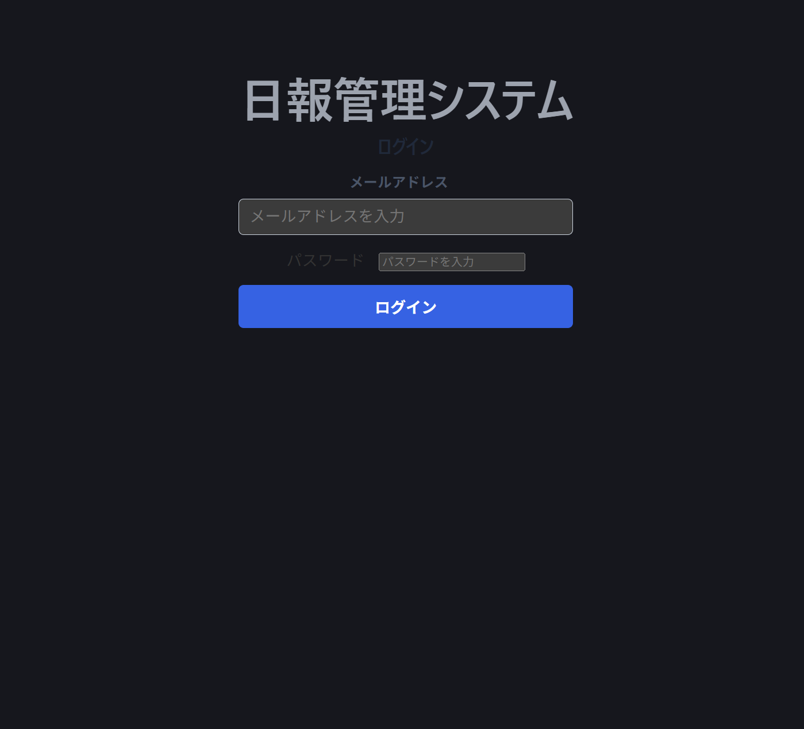
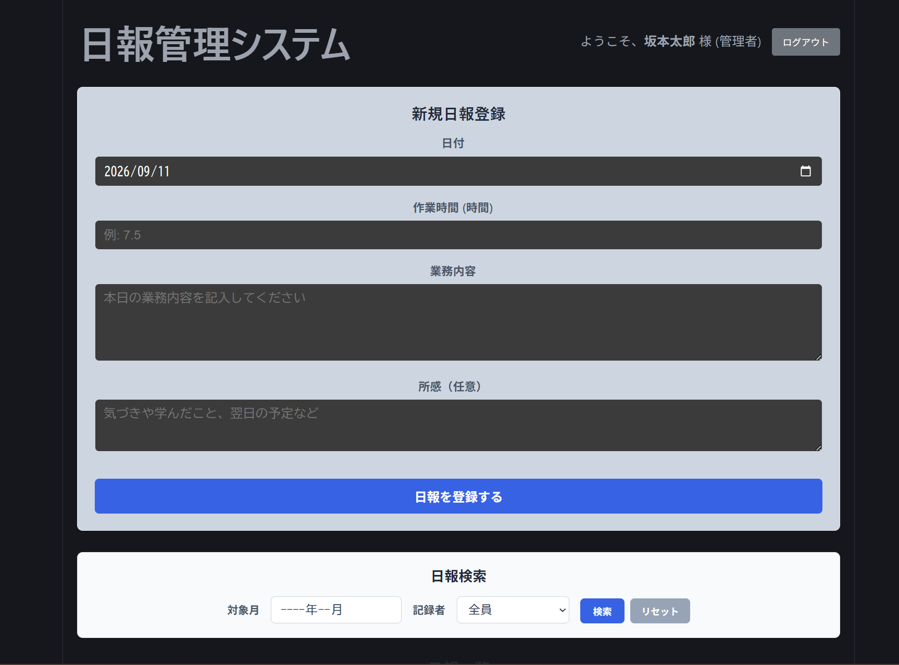
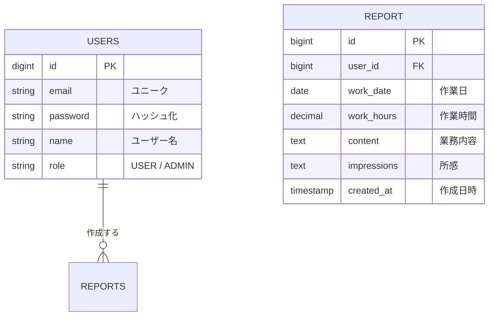
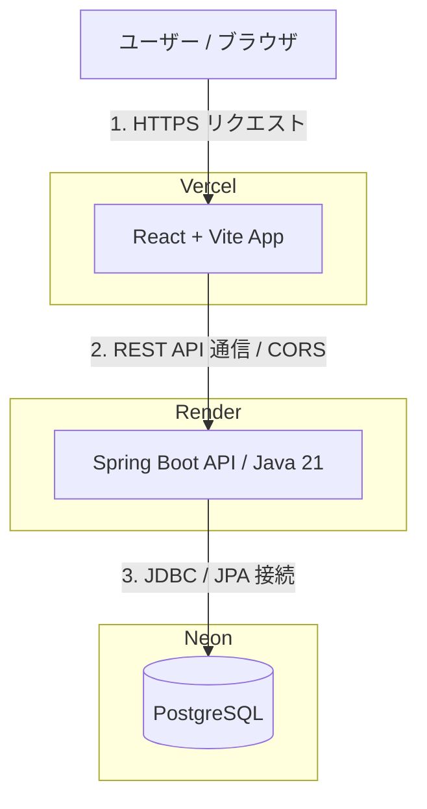

# 日報管理システム（Daily Report Management System)

### 業務をスムーズに共有。現場の声を集約するフルスタック日報管理アプリ

Spring Boot(バックエンドAPI)とReact（フロントエンド）で構築された、業務利用を想定したフルスタックの日報管理Webアプリケーションです。

## 🌐デプロイURL
フロントエンド：https://daily-report-frontend-ecru.vercel.app  
バックエンド：https://daily-report-api-zurb.onrender.com

ーーーーー

## 💻画面イメージ
### ログイン画面

### 日報一覧・検索画面

ーーーーー

## 🍃開発環境
### バックエンド
・言語／フレームワーク：Java21 / Spring Boot  
・ビルドツール：Gradle  
・セキュリティ：Spring Security（認証・ロール制御）  
・ORマッピング：Spring Data JPA  
・データベース：Neon PostgreSQL（本番） / MySQL（ローカル　Docker）

### フロントエンド
・ライブラリ：React / Vite  
・通信：Axios

### インフラ・デプロイ
・フロントエンドホスティング：Vercel  
・バックエンドホスティング：Render  
・データベース：Neon  
・コンテナ化：Docker  
・バージョン管理；Git / GitHub

ーーーーー

## ✨主な機能一覧
### 1．認証・権限管理（RBAC）
・ログイン／ログアウト：メールアドレスとパスワードによる認証。  
・ロール別アクセス制御：  
USER(一般) ⇒ 自身の日報登録・編集・閲覧。  
ADMIN(管理者) ⇒ 全機能に加え、日報の削除権限を保持。

### 2.日報データのCRUD操作
・新規登録：作業日、作業時間、業務内容、所感を登録。  
・編集：一覧から選択した日報データをフォームへ呼び出し、スムーズに更新。  
・削除：管理者権限(ADMIN)ユーザーのみ削除可能。

### 3.UI/UX・表示機能
・Excelスタイルのtabularデザイン：カード型ではなく枠線を抑えた見やすいテーブルレイアウトを採用。  
・ホバー・スクロール対応：レコード洗濯時のスムーズスクロールや視認性の高いUI。

### 4．検索・フィルタリング
・対象月検索：YYYY-MM形式での動的絞り込み。  
・記録者検索：既存データから自動生成されたドロップダウンリストによる絞り込み。  
・リセット機能：1クリックで検索条件をクリアし全件再表示。

## 📉ER図

